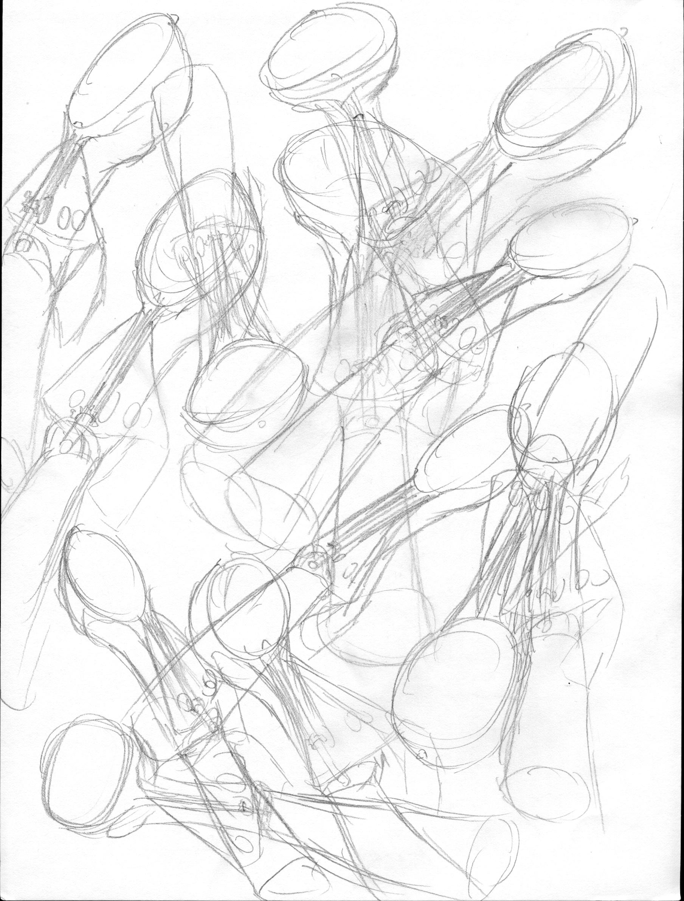

# Project-1
This repository contains the boiler plate code for the students to start coding for their project-1 with Bootstrap.
<!DOCTYPE html>
<html lang="en">
  <head>
    <meta charset="utf-8">
    <meta http-equiv="X-UA-Compatible" content="IE=edge">
    <meta name="viewport" content="width=device-width, initial-scale=1">
    <!-- The above 3 meta tags *must* come first in the head; any other head content must come *after* these tags -->
    <title>Bootstrap 101 Template</title>

    <!-- Bootstrap -->
    <link href="css/bootstrap.min.css" rel="stylesheet">

    <!-- HTML5 shim and Respond.js for IE8 support of HTML5 elements and media queries -->
    <!-- WARNING: Respond.js doesn't work if you view the page via file:// -->
    <!--[if lt IE 9]>
      
      
    <![endif]-->
  </head>
  <body>
    <h1>Art Project</h1>
    

    
    
The Project starts with an object. Initially we needed to sketch the object for 100 times. The object I chose was an ice cream scoop. The sketch is tedious because it required 100 of them, but I managed to finish it. 

    

    
    
    
    
The second section required me to simplify the object’s shade and detail into a simple shape. The shape itself should as accurate and consistent. In another word, it needs to be able to identify with same object as original. It is hard to make because there are so many details that I wanted to remain or feel inappropriate to leave behind hence, the result is not as satisfying as it was. 

    
    

    

    
    
The third and final part is to make it interact with the object to define the usage of the object as minimalistic as possible. This is hardest part. I had to consider the distance between the object and other objects to make it understandable. I did not make it perfectly. 
 
    
 
    

    <!-- jQuery (necessary for Bootstrap's JavaScript plugins) -->
    
    <!-- Include all compiled plugins (below), or include individual files as needed -->
    
  </body>
</html>
